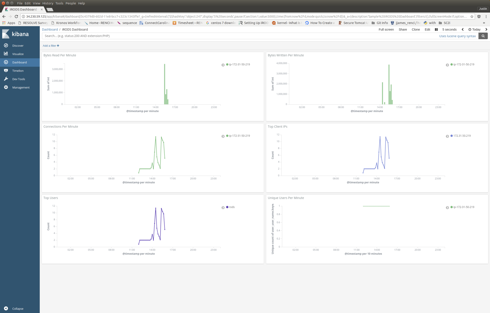

#

The [iRODS Audit Rule Engine Plugin](https://github.com/irods/irods_rule_engine_plugin_audit_amqp/) provides the iRODS platform a C++ rule engine that emits a single AMQP message to the configured topic for every policy enforcement point (PEP) encountered by the iRODS server.

This rule engine plugin can be used to populate Elasticsearch or OpenSearch and provide a platform for discovery and dashboarding of what has happened within the iRODS system over time.

The following screenshot shows a Kibana dashboard with timeseries data for:

 - Bytes Read Per Minute
 - Bytes Written Per Minute
 - Connections Per Minute
 - Top Client IPs
 - Top Users
 - Unique Users Per Minute

