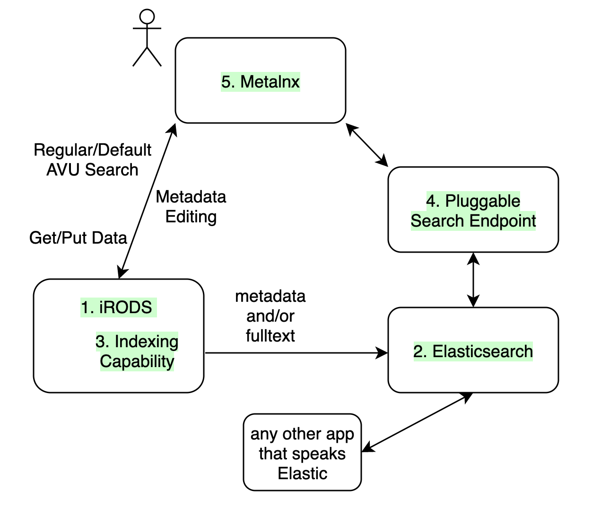

#

The [iRODS Indexing Capability](https://github.com/irods/irods_capability_indexing) provides a policy framework around both full text and metadata indexing for the purposes of enhanced data discovery. Logical collections are annotated with metadata which indicates that any data objects or nested collections of data objects should be indexed given a particular indexing technology, index type, and index name.

With this set of C++ plugins, an iRODS server can populate an Elasticsearch or OpenSearch database with information from the iRODS Catalog.  This can provide a more efficient and familiar search interface for other existing tools and developers.

When a collection is annotated for indexing, all its subcollections and data objects are queued for indexing.  If a new data object is added, or a data object is modified, it will be queued for indexing.

## Working with Metalnx

The Metalnx web application provides a browse and search interface into iRODS.  By default, its searches query the iRODS Catalog directly.  But, with an additional search endpoint, it can get its results from Elasticsearch or OpenSearch instead.

- [1. iRODS](#irods)
- [2. Elasticsearch or OpenSearch](#elasticsearch-or-opensearch)
- [3. Indexing Capability](#indexing-capability)
- [4. Pluggable Search Endpoint](#pluggable-search-endpoint)
- [5. Metalnx](#metalnx)



### 1. iRODS

requires 4.2.10+

### 2. Elasticsearch or OpenSearch

#### run

```
$ docker run -d \
     -p 9200:9200 -p 9300:9300 \
     -e "discovery.type=single-node" \
     -v elast_data:/usr/share/elasticsearch/data \
     docker.elastic.co/elasticsearch/elasticsearch:latest
```

#### add indices

```
$ curl -X PUT -H'Content-Type: application/json' http://localhost:9200/full_text

$ curl -X PUT -H'Content-Type: application/json' http://localhost:9200/full_text/_mapping/text --data '{ "properties" : { "absolutePath" : { "type" : "keyword" }, "data" : { "type" : "text" } } }'
```

```
$ curl -X PUT -H'Content-Type: application/json' http://localhost:9200/metadata

$ curl -X PUT -H'Content-Type: application/json' http://localhost:9200/metadata/_mapping/text --data-binary "@/home/repos/irods_capability_indexing/es_mapping.json"

```

show indices

```
$ curl http://localhost:9200/_cat/indices
```

### 3. Indexing Capability

requires 4.2.11.0+

#### install

install from `packages.irods.org`:

```
$ sudo yum install -y irods-rule-engine-plugin-elasticsearch irods-rule-engine-plugin-indexing
```

#### configure

add to `server_config.json` (note the es_version):

```
    "rule_engines": [
            {
                "instance_name": "irods_rule_engine_plugin-indexing-instance",
                "plugin_name": "irods_rule_engine_plugin-indexing",
                "plugin_specific_configuration": {
                }
            },
            {
                "instance_name": "irods_rule_engine_plugin-elasticsearch-instance",
                "plugin_name": "irods_rule_engine_plugin-elasticsearch",
                "plugin_specific_configuration": {
                    "hosts" : ["http://localhost:9200/"],
                    "bulk_count" : 100,
                    "es_version" : "6.x",
                    "read_size" : 4194304
                }
            },
        ]
```

#### use

create a collection, and designate it for indexing

```
$ imkdir indexme
$ imeta add -C indexme irods::indexing::index metadata::metadata elasticsearch
```

confirm the system is watching that collection

```
$ iqstat
id     name
10018 {"collection-name":"/tempZone/home/rods/indexme","index-name":"metadata","index-type":"metadata","indexer":"elasticsearch","rule-engine-instance-name":"irods_rule_engine_plugin-indexing-instance","rule-engine-operation":"irods_policy_indexing_collection_index","user-name":"rods"} 
```

#### confirm

wait for the delay server to wake up a couple times...

confirm elastic has been informed

```
$ curl -XGET 'localhost:9200/metadata/_search?pretty' -H 'Content-Type: application/json' -d'{}'
{
  "took" : 2,
  "timed_out" : false,
  "_shards" : {
    "total" : 5,
    "successful" : 5,
    "skipped" : 0,
    "failed" : 0
  },
  "hits" : {
    "total" : 1,
    "max_score" : 1.0,
    "hits" : [
      {
        "_index" : "metadata",
        "_type" : "_doc",
        "_id" : "10016",
        "_score" : 1.0,
        "_source" : {
          "absolutePath" : "/tempZone/home/rods/indexme",
          "dataSize" : 0,
          "fileName" : "indexme",
          "isFile" : false,
          "lastModifiedDate" : 1635537255,
          "metadataEntries" : [ ],
          "mimeType" : "",
          "parentPath" : "/tempZone/home/rods",
          "url" : "http://tempZone/home/rods/indexme",
          "zoneName" : "tempZone"
        }
      }
    ]
  }
}
```

### 4. Pluggable Search Endpoint

eventually via docker hub, but for now, unreleased

#### configure

```
$ git clone https://github.com/irods/metalnx_search_endpoint_elasticsearch
$ cd metalnx_search_endpoint_elasticsearch
$ cp server.properties.template server.properties
```

edit `es.baseurl` and `jwt.secret`

```
es.baseurl=http://172.17.0.1:9200
jwt.issuer=metalnx
jwt.secret=secretsecretsecretsecretsecretsecretsecretsecret
jwt.lifetime.seconds=600
jwt.algo=HS384
project.url.prefix=deprecated
```

the `jwt.secret` must match the configured value in Metalnx

#### build

```
$ docker build -t metalnx_search_elasticsearch .
```

#### run

```
$ docker run -p 8082:8082 -v $(pwd)/server.properties:/etc/irods-ext/project-and-sample-search.properties metalnx_search_elasticsearch
```

### 5. Metalnx

2.6.0+ will work from docker hub.

#### configure

clone repository

```
$ git clone https://github.com/irods-contrib/metalnx-web
$ cd metalnx-web
```

copy three configuration files

```
$ mkdir metalnx-configuration
$ cd metalnx-configuration
$ cp ../docker-test-framework/etc/irods-ext/customMetalnxConfig.xml .
$ cp ../docker-test-framework/etc/irods-ext/metalnx.properties .
$ cp ../docker-test-framework/etc/irods-ext/metalnxConfig.xml .
```

update `metalnx.properties`

```
irods.host=172.17.0.1            
db.url=jdbc:postgresql://db:5432/metalnxdb
db.username=metalnxuser
db.password=superdupersecret
jwt.secret=secretsecretsecretsecretsecretsecretsecretsecret
pluggablesearch.endpointRegistryList=http://172.17.0.1:8082/v1
pluggablesearch.enabled=true
```

create `docker-compose.yml`

```
version: '3'

services:

  db:
    image: postgres:11
    restart: always
    environment:
      POSTGRES_PASSWORD: superdupersecret
      POSTGRES_USER: metalnxuser
      POSTGRES_DB: metalnxdb

  metalnx:
    image: irods/metalnx:latest
    restart: always
    volumes:
      - ./metalnx-configuration:/etc/irods-ext
    ports:
      - 9000:8080
```

#### run

get docker compose

```
$ sudo curl -L "https://github.com/docker/compose/releases/download/latest/docker-compose-$(uname -s)-$(uname -m)" -o /usr/local/bin/docker-compose
$ sudo chmod +x /usr/local/bin/docker-compose
```

```
$ docker-compose up
```
