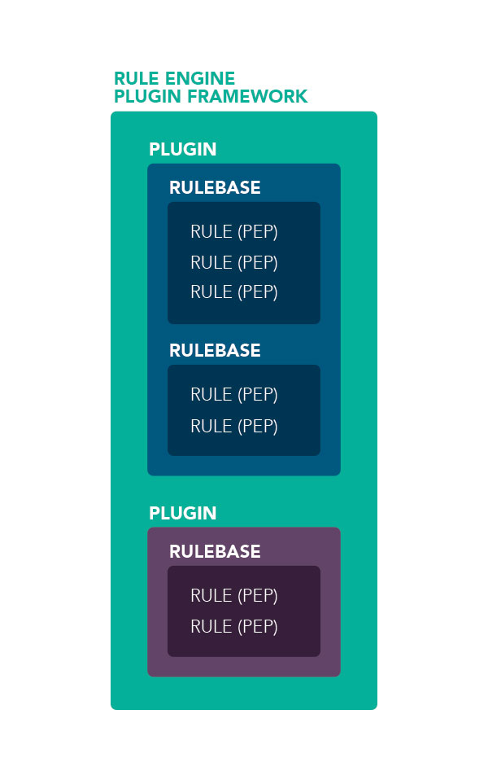

#

iRODS 4.2+ introduced the iRODS rule engine plugin interface.  This plugin interface allows iRODS administrators and users to write iRODS policy rules in languages other than the [legacy iRODS Rule Language](irods_rule_language.md).

Rule engine plugins are written in C++, installed on a particular iRODS server, and configured in that server's `server_config.json`.

The iRODS Consortium currently supports the following rule engine plugins:

 - [Legacy iRODS Rule Language Rule Engine Plugin](https://github.com/irods/irods/tree/master/plugins/rule_engines/irods_rule_engine_plugin-irods_rule_language)
 - [Python Rule Engine Plugin](https://github.com/irods/irods_rule_engine_plugin_python)
 - [C++ Default Policy Rule Engine Plugin](https://github.com/irods/irods/tree/master/plugins/rule_engines/irods_rule_engine_plugin-cpp_default_policy)
 - [C++ Audit (AMQP) Rule Engine Plugin](https://github.com/irods/irods_rule_engine_plugin_audit_amqp)
 - [C++ Logical Quotas Rule Engine Plugin](https://github.com/irods/irods_rule_engine_plugin_logical_quotas)
 - [C++ Metadata Guard Rule Engine Plugin](https://github.com/irods/irods_rule_engine_plugin_metadata_guard)
 - [C++ Storage Tiering Rule Engine Plugin](https://github.com/irods/irods_capability_storage_tiering)


## Rule Engine Plugin Framework

The Rule Engine Plugin Framework (REPF), which keeps track of state and interprets both system-defined rules and user-defined rules, is a critical component of the iRODS system.  Rules are definitions of actions that are to be performed by the server.  These actions are defined in multiple ways, depending on the language that is used to define the actions.  In the native iRODS Rule Language, the actions are defined with microservices and other actions.  The REPF determines which defined rules are loaded and active and then delegates to the plugins to execute any relevant action.  In the case of the legacy iRODS Rule Language Rule Engine Plugin, it interprets the rules and calls the appropriate microservices.  For the Python Rule Engine Plugin, it loads the python interpreter and executes the named function definitions as appropriate.

## Configuration (server_config.json)

Because the rule engine plugins are just one of many iRODS plugin types, the REPF is configured within the following stanza in `server_config.json`:

```
{
    "plugin_configuration": {
        "rule_engines": []
    }
}
```

Within the rule engine plugin framework, there are dynamically created policy enforcement points that are checked before and after every operation.  These are the "_pre", "_post", "_except", and "_finally" PEPs discussed in [Dynamic Policy Enforcement Points](dynamic_policy_enforcement_points.md).

The framework will look for rules that are defined with the same name as the PEP and execute them if found.  A typical `ils` will trigger over 1200 dynamic PEPs on a basic installation.  Nearly all of them will be undefined (there is no rule that matches their name) and so will not run any code.

However, any that *do* match a particular PEP will be executed in the order in which they are loaded.  If there is only one matching rule, then it will fire and its return code will be interpreted by the REPF.  If it fails, then the operation fails as well and an error is returned to the client (or to the log when run by the [delay execution server](#delay-execution).)

If there is more than one matching rule for a particular PEP, the first one loaded will fire first.  If it succeeds, then the others are ignored.  If the first one fails, then the next matching rule is fired.  If it fails, then the framework will continue to "fall through" until there are no more matching rules.  The return code of the last matching rule will be the one that is returned.



This "fall through" mechanism also applies across rule engine plugins (meaning, across language as well).

There are three scopes where the "fall through" will occur:

- within the framework itself, falling from one plugin to another
- within a plugin, falling from one rulebase to another
- within a rulebase, falling from one rule to another

This nested scope defines the order in which identically named rules take precedent on a particular iRODS server.

### Example

Consider the following `server_config.json` with the accompanying `example.re`, `core.re` and `core.py` rulebases:

```
{
    "plugin_configuration": {
        "rule_engines": [
            {
                "instance_name": "irods_rule_engine_plugin-python-instance",
                "plugin_name": "irods_rule_engine_plugin-python",
                "plugin_specific_configuration": {}
            },
            {
                "instance_name": "irods_rule_engine_plugin-irods_rule_language-instance",
                "plugin_name": "irods_rule_engine_plugin-irods_rule_language",
                "plugin_specific_configuration": {
                    "re_data_variable_mapping_set": [
                        "core"
                    ],
                    "re_function_name_mapping_set": [
                        "core"
                    ],
                    "re_rulebase_set": [
                        "example",
                        "core"
                    ],
                    "regexes_for_supported_peps": [
                        "ac[^ ]*",
                        "msi[^ ]*",
                        "[^ ]*pep_[^ ]*_(pre|post|except|finally)"
                    ]
                },
                "shared_memory_instance": "irods_rule_language_rule_engine"
            }
        ]
    }
}
```

```python
# core.py
def pep_resource_close_pre(rule_args, callback, rei):
    callback.writeLine("serverLog","XXXX - core.py")
```

```
# example.re
pep_resource_close_pre(*INSTANCE, *CONTEXT, *OUT){
    writeLine("serverLog","XXXX - example.re")
}
```

```
# core.re
pep_resource_close_pre(*INSTANCE, *CONTEXT, *OUT){
    writeLine("serverLog","XXXX - core.re top")
}

pep_resource_close_pre(*INSTANCE, *CONTEXT, *OUT){
    writeLine("serverLog","XXXX - core.re bottom")
}
```


## Selecting rule engine via irule

With the addition of rule engine plugins, `irule` now has a way to specify which rule engine should be running
any submitted code snippet.

By default, `irule` will submit its code snippet (or named rulefile) to the rule engine plugin listed first
in the "rule_engines" array of `server_config.json`.

To specify a particular other instance of rule engine plugin, `irule` must use the `-r` flag:

```
$ irule -r irods_rule_engine_plugin-irods_rule_language-instance -F myrulefile.r
```

To see the available instance names on the connected server:

```
$ irule -a
```


## Delay execution

Rules can be run one of three ways.

 - Manually, via irule
 - Triggered, via Policy Enforcement Points (PEPs)
 - Periodically, via delayed execution


Most of the actions and microservices executed by the rule engine are executed manually or via PEPs, however, some actions are better suited to be placed in a queue and executed later.  The actions and microservices which are to be executed in delay mode can be queued with the `delay` microservice.

Typically, delayed actions and microservices are resource-heavy, time-intensive processes, better suited to being carried out without having the user wait for their completion.  These delayed processes can also be used for cleanup and general maintenance of the iRODS system, like the cron in UNIX.

Monitoring the delayed queue is important once your workflows and maintenance scripts depend on the health of the system. The delayed queue can be managed with the following three iCommands:

1. iqstat   - show the queue status of delayed rules.
2. iqmod    - modify certain values in existing delayed rules (owned by you).
3. iqdel    - remove a delayed rule (owned by you) from the queue.

!!! Note
    Actions that are being executed by a delay are bound to a maximum size. A rule that is over 2700 characters long cannot be executed by a delay or remote command.  This is fixed by using policy functions and loading the functions as a .re file.

### Syntax

The `delay` microservice is invoked with the following syntax:

~~~c
delay("hints") {
        microservice-chain_part1;
        microservice-chain_part2;
        microservice-chain_part3;
        .
        .
        .
        microservice-chain_partN;
   }
~~~

"hints" (required) are of the form:

  - `ET` - Execution Time - Absolute time (without time zones) when the delayed execution should be performed. The input can be incremental time given in:
    - `nnnn` - an integer - assumed to be in seconds
    - `nnnnU` - `nnnn` is an integer, `U` is the unit (s-seconds, m-minutes, h-hours, d-days, y-years)
    - `dd.hh:mm:ss` - 2-digit integers representing days, hours, minutes, and seconds, respectively. Most significant values can be omitted (e.g. 20:40 means mm:ss)
    - `YYYY-MM-DD.hh:mm:ss` - Least significant values can be omitted (e.g. 2015-07-29.12 means noon of July 29, 2015)
  - `PLUSET` - Relative Execution Time - Relative to current time when the delayed execution should be performed.
  - `PRIORITY` - Scheduled Execution Order - Controls the execution order of scheduled rules. Valid priority values are integers in the range [1, 9] where 9 represents the highest priority (executed earlier). Default priority is 5.
  - `INST_NAME` - Rule Engine Instance Name - Rule engine instance on which the delayed rule will execute. If the instance name is not found, the execution will fail with `SYS_INVALID_INPUT_PARAM`.
  - `EF` - Execution Frequency - How often the delayed execution should be performed. The `EF` value is of the form:
    - `nnnnU <directive>` where
      - `nnnn` is an integer, `U` is the unit (s-seconds, m-minutes, h-hours, d-days, y-years)
      - `<directive>` can be of the form:
        - `<empty-directive>` - equivalent to `REPEAT FOR EVER`
        - `REPEAT FOR EVER`
        - `REPEAT UNTIL SUCCESS`
        - `REPEAT nnnn TIMES` - `nnnn` is an integer
        - `REPEAT UNTIL <time>` - `<time>` is of the form `YYYY-MM-DD.hh:mm:ss`
        - `REPEAT UNTIL SUCCESS OR UNTIL <time>`
        - `REPEAT UNTIL SUCCESS OR nnnn TIMES`
        - `DOUBLE FOR EVER`
        - `DOUBLE UNTIL SUCCESS`
        - `DOUBLE nnnn TIMES`
        - `DOUBLE UNTIL <time>`
        - `DOUBLE UNTIL SUCCESS OR UNTIL <time>`
        - `DOUBLE UNTIL SUCCESS OR nnnn TIMES`

### Examples

This example will queue the chain of microservices to begin in 1 minute and repeat every 20 minutes forever:

~~~c
delay("<PLUSET>1m</PLUSET><EF>20m</EF>") {
    writeLine("serverLog", " -- Delayed Execution");
}
~~~


## Remote execution

A microservice chain can be executed on a remote iRODS server. This gives the flexibility to 'park' microservices where it is most optimal. For example, if there is a microservice which needs considerable computational power, then performing it at a compute-intensive site would be appropriate. Similarly, if one is computing checksums, performing it at the server where the data is located would be more appropriate.

### Syntax

The `remote` microservice is invoked with the following syntax:

~~~c
remote("host","hints") {
        microservice-chain_part1;
        microservice-chain_part2;
        microservice-chain_part3;
        .
        .
        .
        microservice-chain_partN;
   }
~~~

"host" (required) is the hostname on which the remote execution should be performed.

"hints" (required) are of the form:

  - `ZONE` - Remote Zone - The name of the Zone in which the "host" is located.

### Examples

This example will execute the chain of microservices on the host "resource.example.org" in the local Zone:

~~~c
remote("resource.example.org","") {
    writeLine("serverLog", " -- Remote Execution in Local Zone");
}
~~~

This example will execute the chain of microservices on the host "farawayicat.example.org" in the remote Zone named "DifferentZone":

~~~c
remote("farawayicat.example.org","<ZONE>DifferentZone</ZONE>") {
    writeLine("serverLog", " -- Remote Zone Execution");
}
~~~

The best practice for using both `delay()` and `remote()` [depends on the use case](../system_overview/best_practices.md#using-both-delay-and-remote-execution).


<!--
..
.. ---------------
.. Delay Execution
.. ---------------
.. - how
.. - what
.. - when
.. - where
.. - why
.. - errors
.. - queue management
.. - file locking
..
.. ----------
.. Monitoring
.. ----------
.. - nagios plugins (Jean-Yves)
.. - other
.. - Failover checking
..
-->
