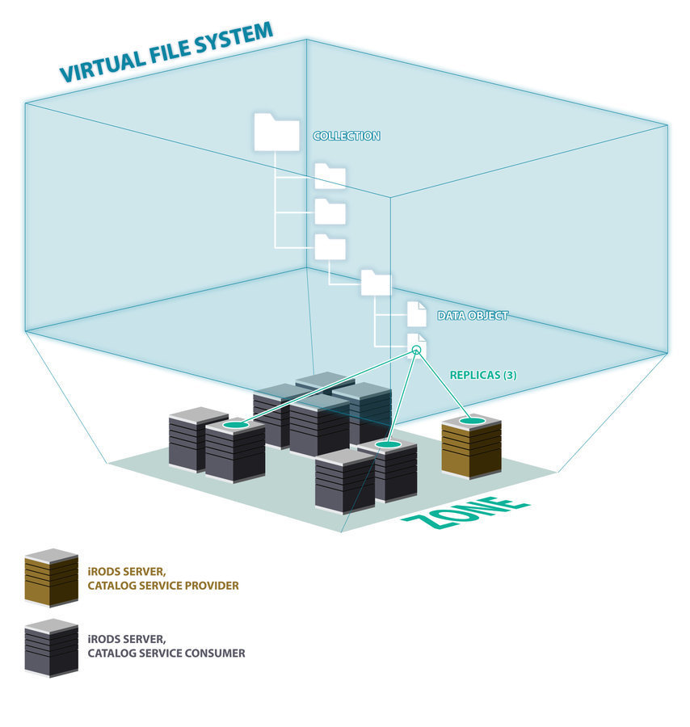
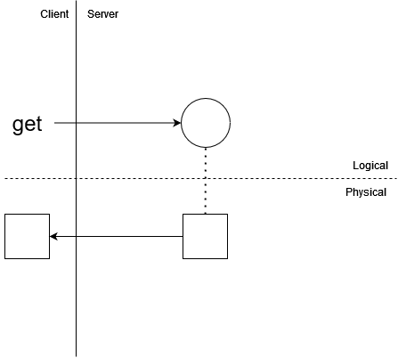
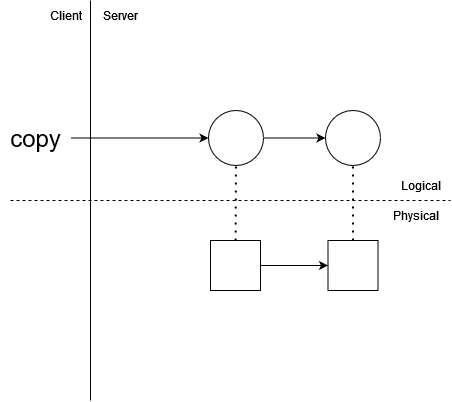
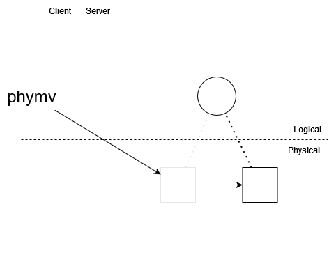
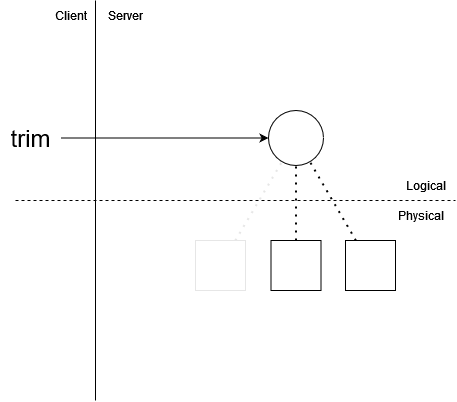
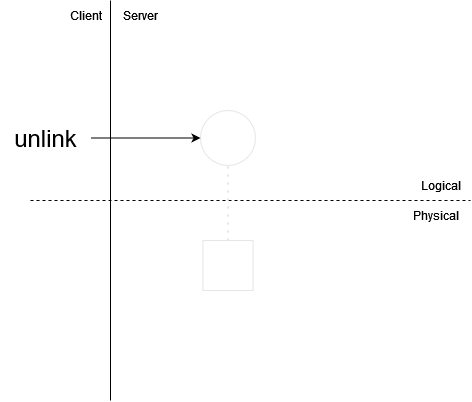
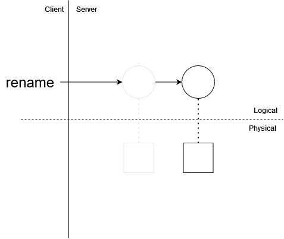

#

## Data Objects and Replicas

Data Objects are logical entities in the virtual filesystem presented by iRODS. A data object is given a unique identifier (data ID) in the iRODS Catalog, and is associated with (situated in) a Collection. This data ID and Catalog association (known as the Logical Path) are what define a data object in the iRODS Zone. Collections are also given unique identifiers called collection IDs.

Data objects map to one or more Replicas, which are physical instances of the data at rest in storage resources. Replicas are identified by their host storage resources as well as a unique replica number. Only one replica for a given data object may reside in a given storage resource.

This diagram gives a visual demonstration of the way the virtual filesystem is projected into a physical iRODS Zone:



### Replica Status

Replica Status refers to a value which represents the state of a replica. There are currently 4 possible states for a replica with a fifth which acts as a placeholder for to-be-implemented functionality. The integers preceding each of the following items is the literal value used for the status in the iRODS catalog in the `data_is_dirty` field for a given replica.

- 0: **stale**: The replica is no longer known to be good. This does not mean that the data are incorrect or "bad". This could mean one of the following things:
    - The data in storage may not match what is in the catalog. This could be due to errors during the data transfer, mismatched checksums, or data corruption.
    - The replica may not reflect how the data "should" be. Usually this means that a sibling replica has been written to more recently. The data may or may not differ, but there is no way for the iRODS system to guarantee this without additional policy in place. Therefore, sibling replicas are marked stale if one of the sibling replicas is changed.

When a replica is marked stale, the `ils -l` command will indicate this with an 'X' in the output:
```
$ ils -l /tempZone/home/rods/foo
  rods              0 resc_0          284 2022-07-20.17:31 X foo
```

- 1: **good**: The replica is at rest in a storage resource, and all bytes and system metadata (size and checksum, if present) are understood to have been recorded correctly. When a replica is marked good, the `ils -l` command will indicate this with an ampersand ('&') in the output:
```
$ ils -l /tempZone/home/rods/foo
  rods              0 resc_0          284 2022-07-20.17:31 & foo
```

- 2: **intermediate**: The replica is actively being written to. The state of the replica cannot be determined as good or bad because the client writing to it still has the replica opened and has not finalized the transfer of data. Replicas which are intermediate cannot be opened for read or write, nor can they be unlinked or renamed. When a replica is marked as intermediate, the `ils -l` command will indicate this with a question mark ('?') in the output:
```
$ ils -l /tempZone/home/rods/foo
  rods              0 resc_0          284 2022-07-20.17:31 ? foo
```

- 3: **read-locked**: (currently unused)

- 4: **write-locked**: One of this replica's sibling replicas is actively being written to but is itself at rest. Replicas which are write-locked cannot be opened for read or write nor can they be unlinked or renamed. Write-locked replicas are considered at rest, but the status means that one of its sibling replicas is currently in the intermediate status. This will be described in more detail in the [Logical Locking](#logical-locking) section. When a replica is marked as write-locked, the `ils -l` command will indicate this with a question mark ('?') in the output:
```
$ ils -l /tempZone/home/rods/foo
  rods              0 resc_0          284 2022-07-20.17:31 ? foo
  rods              1 resc_1          284 2022-07-20.17:31 ? foo
```

## Logical Locking

### Overview

In a distributed system like iRODS, concurrency presents a number of problems, of which we will consider 3:

1. In-flight replicas can be opened and modified concurrently by multiple agents in an uncoordinated fashion, and the catalog does not reflect the current, true state of the data. Therefore, uncoordinated, concurrent writing to a single replica can lead to **data corruption**.
2. It is unclear which replicas for a given data object represent how the data "should" be when multiple replicas are in flight at the same time. Therefore, uncoordinated, concurrent writing to multiple replicas of the same data object causes **data incoherence**.
3. If a data-modifying operation is impacted by policy execution which leads to other data-modifying operations, other concurrent, uncoordinated data-modifying operations can lead to violations in said policy. Uncoordinated, concurrent operation execution can lead to **policy violations**.

iRODS protects against such uncoordinated concurrency through a zone-wide system known as **Logical Locking**. Basically, logical locking ensures that whenever a replica is opened for write (or create), the data object is locked until the replica is closed and the data object is finalized, at which point the data object will be unlocked and made available for opening. When a data object is locked, none of the replicas for the data object can be opened for read or write by other agents in an uncoordinated fashion. (We will explain how to perform a coordinated open of a locked data object elsewhere).

### Design

iRODS Logical Locking operates on the basic principles of a traditional read-write lock in computing:

1. The Data Object is locked when any of its replicas are opened.
2. The Data Object is unlocked when the opened replica is closed/finalized.

Here, we describe this process in more detail:

#### The Data Object is locked when any of its replicas are opened

1. Client requests to open a replica of a given Data Object.
2. iRODS checks the status of the replica to make sure it is not already locked (equivalent to trying to ”acquire” the lock). ”Locked” in this case means:
    - a. The replica is Write-Locked (a sibling replica is Intermediate): the operation will fail.
    - b. The replica is Intermediate: the operation will fail for an uncoordinated open-for-write or any open-for-read.
    - c. If the open intends to create a new replica, the operation will fail if any replica is found not to be at rest (that is, Intermediate or Write-Locked).
3. Depending on the operation, the Data Object is then locked for this open. "Locked" in this case means:
    - a. open-for-write: the status of the target replica is set to Intermediate and the statuses of the sibling replicas are set to Write-Locked
    - b. open-for-create: the statuses of any existing sibling replicas are set to Write-Locked
4. The target replica is then physically opened and the open is complete. If a new replica is supposed to have been created, the entry is created in the catalog in the Intermediate status.

#### The Data Object is unlocked when the opened replica is closed/finalized

1. The client requests to close and finalize a replica of a given Data Object.
2. The Data Object is unlocked atomically along with updating the other system metadata. The final states of the replicas depends mainly on the operation requesting the close. The general cases for unlocking are shown here, but some operations (e.g. replication, phymv, etc.) may behave differently as they have different requirements:
    - a. open-for-read: if no other agents have any of the replicas opened, the replica statuses of each replica is restored to what it was before the open
    - b. open-for-write: there are two cases: On success, the target replica is marked Good and all sibling replicas are marked Stale. On failure, the target replica is marked Stale and all sibling replicas have their statuses restored to what they were before the open.

## High-Level Operations

There are a number of operations which can be performed on a data object. We will describe each one in detail here.

First, we will define a couple of terms:

**Creating a new data object**

*Logical* operations have the ability to create a **new data object**. A new data object implies that a **new replica** will be created and, at least at first, will serve as the first and only replica mapped to the new data object. This may not involve data movement. Existing data in storage can be registered as the first replica of a new data object.

That being said, creating a data object via a *logical* operation requires a storage resource which will host the replica mapped to the new data object. This can be specified as input to the operation by the client or a hierarchy resolved by the server.

**Overwriting an existing data object**

*Logical* operations have the ability to **overwrite** an existing data object. All *logical* operations which write data will target a replica on a storage resource. Once the target replica has been finalized, the target replica will be marked good and all sibling replicas will be marked stale.

When overwriting a data object, the destination resource must have an at-rest replica to overwrite. If this is not the case, the *logical* operation is being asked to create a new replica. This is not allowed because creating a new replica on an existing data object is a *physical* operation. The logical operations in iRODS will not make an attempt to bridge the logical and physical layers in this way as it can lead to inconsistency and suprising behavior for some users.

### Put

The Put operation transfers a known, fixed number of bytes from a client to a data object. The most common use case is a client reading bytes from a local file and writing them to a new data object.


Put requires 2 inputs:

1. Bytes to transfer with a known, fixed size (for example, a file) that can be read by the client
2. A data object to which data will be written

If the destination resource has no at-rest replica for the target data object, the put is *allowed* only if the data object does not exist. If this is true, put is creating a **new data object**. If this is not true, the data object has one or more replicas on other resources.

If the destination resource has an at-rest replica for the target data object, the put is *allowed* only when the client has specified a forced overwrite. If this is true, put will **overwrite** the destination data object.

In the following cases, '&' represents a good replica, 'X' represents a stale replica, and '-' indicates a replica which does not exist. This table shows the initial statuses of the replicas for the target data object, the resulting replica statuses of the replicas after the put, and the reason for the result. In each case, Replica A is being targeted for a put and it is assumed that forced overwrite has been indicated by the user.

| Case | Replica A start | Replica B start | Replica A end | Replica B end | Reason |
| ---- | --------------- | --------------- | ------------- | ------------- | ------ |
| 0 | - | - | & | - | New data object created with a single replica |
| 1 | - | & | - | & | Creating a new replica on an existing data object is not allowed with put |
| 2 | - | X | - | X | Creating a new replica on an existing data object is not allowed with put |
| 3 | & | - | & | - | Overwriting an existing replica of a data object is allowed |
| 4 | & | & | & | X | Overwriting an existing replica of a data object is allowed |
| 5 | & | X | & | X | Overwriting an existing replica of a data object is allowed |
| 6 | X | - | & | - | Overwriting an existing replica of a data object is allowed |
| 7 | X | & | & | X | Overwriting an existing replica of a data object is allowed |
| 8 | X | X | & | X | Overwriting an existing replica of a data object is allowed |

### Get

The Get operation transfers all bytes from an existing, at-rest data object to the client. The most common use case is a client reading bytes from a data object and writing them to a local file.



For input, get requires only a data object from which data will be read. The data object must already have an existing, at-rest replica which can be read in order for get to be *possible* in any case.

In the following cases, '&' represents a good replica, 'X' represents a stale replica, and '-' indicates a replica which does not exist. This table shows the statuses of the two replicas of the source data object for a get. In each case, replica A is being targeted for a get.

| Case | Replica A | Replica B | Result | Reason |
| ---- | --------- | --------- | ------ | ------ |
| 0 | - | - | - | The data object does not exist |
| 1 | - | & | - | The specified source resource has no replica |
| 2 | - | X | - | The specified source resource has no replica |
| 3 | & | - | & | Get of good replica is allowed |
| 4 | & | & | & | Get of good replica is allowed |
| 5 | & | X | & | Get of good replica is allowed |
| 6 | X | - | X | Get of stale replica is allowed |
| 7 | X | & | X | Get of stale replica is allowed |
| 8 | X | X | X | Get of stale replica is allowed |

### Copy

The Copy operation transfers all bytes from an existing, at-rest data object to another data object.



Copy requires 2 inputs:

1. Source data object from which data will be copied
2. Destination data object to which data will be copied

The source data object must already have an existing, at-rest replica on the source resource which can be read in order for copy to be *possible* in any case.

If the destination data object does not exist, copy is *allowed* in all cases. If this is true, copy is creating a **new data object** (and therefore a **new replica**). If this is not true, copy will attempt to **overwrite** the data object.

If the destination data object exists and has an at-rest replica on the destination resource, copy is *allowed* only if the client has specified a forced overwrite. If this is true, copy will **overwrite** the destination data object.

In the following cases, '&' represents a good replica, 'X' represents a stale replica, and '-' indicates a replica which does not exist. This table shows the statuses of two replicas of the destination data object for a copy. In each case, replica A is being targeted as the destination for a copy and it is assumed that the source data object has an at-rest replica on the requested resource (otherwise, copy would not be *possible*).

| Case | Replica A start | Replica B start | Replica A end | Replica B end | Reason |
| ---- | --------------- | --------------- | ------------- | ------------- | ------ |
| 0 | - | - | & | - | Copy is allowed to create a new data object |
| 1 | - | & | - | & | Copy is not allowed to create a new replica of an existing data object |
| 2 | - | X | - | X | Copy is not allowed to create a new replica of an existing data object |
| 3 | & | - | & | - | Copy is allowed to overwrite the data object |
| 4 | & | & | & | X | Copy is allowed to overwrite the data object |
| 5 | & | X | & | X | Copy is allowed to overwrite the data object |
| 6 | X | - | & | - | Copy is allowed to overwrite the data object |
| 7 | X | & | & | X | Copy is allowed to overwrite the data object |
| 8 | X | X | & | X | Copy is allowed to overwrite the data object |

### Replicate

Replicate refers to copying a physical replica of an existing data object from one storage resource to another.


Replicate requires 3 inputs:

1. An existing data object with at least one replica which is at rest and can be read. 
2. Source resource: The resource from which data will be copied/read.
3. Destination resource: The resource to which data will be copied/written.

The source resource must already have an existing, at-rest replica which can be read in order for replication to be *possible* in any case.

If the destination resource has no replica, replication to the destination resource is *allowed* in all cases. If this is true, a **new replica** will appear on the destination resource as a result of the replication. If this is not true, the destination resource has an existing replica.

If the destination resource has an existing replica, replication would be performing a **replica update**. The following requirements must be true in order for updating the replica to be *allowed*:

- The destination resource must not be the source resource
- The destination replica must be stale
- The source replica must be good

In the following cases, ‘X’ represents a stale replica, ‘&’ represents a good replica, and ‘-’ indicates a replica which does not exist. This table shows the initial state of the replica on the source and destination resources, the resulting replica state on the destination resource, and the reason for the result.

| Case | Source | Destination | Result | Reason |
| ---- | ------ | ----------- | ------ | ------ |
| 0 | - | - | unchanged | No source replica exists |
| 1 | - | & | unchanged | No source replica exists |
| 2 | - | X | unchanged | No source replica exists |
| 3 | & | - | & | Replication allowed |
| 4 | & | & | unchanged | Destination replica must be stale |
| 5 | & | X | & | Replication allowed |
| 6 | X | - | X | Replication allowed |
| 7 | X | & | unchanged | Destination replica must be stale |
| 8 | X | X | unchanged | Source replica must be good |

### Phymv

Phymv - or, physical move - refers to moving a physical replica of an existing data object from one storage resource to another. Phymv is functionally equivalent to a replication, a trim of the source replica, and a modification of the destination replica's replica number to match that of the source replica's replica number. To reiterate, phymv is a physical operation that moves a replica from one storage resource to another, which defies configured policy via resource hierarchies. Administrators should consider this when choosing to allow this operation within their zones.



Phymv requires 3 inputs:

1. An existing data object with at least one replica which is at rest and can be read.
2. Source resource: The resource from which data will be read and unlinked.
3. Destination resource: The resource to which data will be written.

The source resource must already have an existing, at-rest replica which can be read in order for phymv to be *possible* in any case.

If the destination resource has no replica, phymv to the destination resource is *allowed* in all cases. If this is true, a **new replica** with the same replica number will appear on the destination resource as a result of the phymv and the replica on the source resource will be unlinked. If this is not true, the destination resource has an existing replica.

If the destination resource has an existing replica, phymv would be performing a **replica update**. The following requirements must be true in order for updating the replica to be *allowed*:

- The destination resource must not be the source resource
- The destination replica must be stale
- The source replica must be good

In the following cases, ‘X’ represents a stale replica, ‘&’ represents a good replica, and ‘-’ indicates a replica which does not exist. This table shows the initial state of the replica on the source and destination resources, the resulting replica state on the destination resource, and the reason for the result.

| Case | Source start | Destination start | Source end | Destination end | Reason |
| ---- | ------------ | ----------------- | ---------- | --------------- | ------ |
| 0 | - | - | - | - | No source replica exists |
| 1 | - | & | - | - | No source replica exists |
| 2 | - | X | - | - | No source replica exists |
| 3 | & | - | - | & | Phymv allowed |
| 4 | & | & | & | & | Destination replica must be stale |
| 5 | & | X | - | & | Phymv allowed |
| 6 | X | - | - | X | Phymv allowed |
| 7 | X | & | X | & | Destination replica must be stale |
| 8 | X | X | X | X | Source replica must be good |

### Trim

Trim refers to unlinking one or more replicas mapped to an existing data object.



Trim requires 2 inputs:

1. An existing data object with at least two replicas which are at rest and can be unlinked.
2. A minimum number of good replicas to retain.

Trim selects stale replicas first, then the good replicas are trimmed from oldest to youngest, down to the specified minimum number of good replicas.

If the data object has fewer than the minimum number of good replicas, trim is not *allowed* in any case.

In the following cases, ‘X’ represents a stale replica, ‘&’ represents a good replica, and ‘-’ indicates a replica which does not exist. This table shows the result of a data object targeted for a trim with a minimum good replica count of 1. The table shows the starting and ending statuses of 2 replicas for a single data object as a string such that the status of replica 0 is the first character and the status of replica 1 is the second character.

| Case | Replica A start | Replica B start | Replica A end | Replica B end | Reason |
| ---- | --------------- | --------------- | ------------- | ------------- | ------ |
| 0 | - | - | - | - | Data object does not exist |
| 1 | - | & | - | & | Data object has fewer than two replicas |
| 2 | - | X | - | X | Data object has fewer than two replicas |
| 3 | & | - | & | - | Data object has fewer than two replicas |
| 4 | & | & | - | & | Trim is allowed\* |
| 5 | & | X | & | - | Trim is allowed |
| 6 | X | - | X | - | Data object has fewer than two replicas |
| 7 | X | & | - | & | Trim is allowed |
| 8 | X | X | X | X | Data object has fewer than the minimum number of good replicas |

\* The oldest repilca is trimmed in case 4

### Unlink

The Unlink operation removes a data object from the iRODS namespace. This means that all replicas are unlinked from their storage and their associated rows in `R_DATA_MAIN` are deleted.



For input, unlink requires only an existing data object which is not locked.

The data object must exist in order for unlink to be *possible* in any case.

### Rename

The Rename operation manipulates the logical path of a data object by changing it to a new path.



Rename requires 2 inputs:

1. An existing data object which is not locked
2. Path to a destination data object

If the destination path exists in the logical namespace, rename is *allowed* only if the path refers to a data object and the client has specified a forced overwrite. Overwriting a collection with a data object is not allowed.

## `R_DATA_MAIN`

Data objects and replicas - as with any iRODS entity - are defined in the iRODS Catalog. The information is stored in the `R_DATA_MAIN` table. Each row in `R_DATA_MAIN` describes a single replica of a data object. Some system metadata is identical for each replica, such as data ID, associated collection, and name -- these are defining features of the data object which maps to the replica. Other system metadata varies between replicas, such as host resource and replica number -- these are defining features of the individual replicas.

The following are all of the columns representing the system metadata in the table as well as their meanings:

 - `data_id`: Identifier unique to the data object that maps to this replica. This column will contain the same value for all replicas of a given data object.
 - `coll_id`: Identifier unique to the parent collection associated with the data object that maps to this replica. This column will contain the same value for all replicas of a given data object. The identifiers are defined in `R_COLL_MAIN` which contains all of the information about collections in a given zone.
 - `data_name`: Logical Name of the data object that maps to this replica. This column will contain the same value for all replicas of a given data object. This value will be unique for all data objects with an identical `coll_id`.
 - `data_repl_num`: Identifier unique to this replica. This value does not have any special meaning in the context of the iRODS system other than being able to identify a replica independently of its host resource.
 - `data_version`: This column is no longer used by iRODS.
 - `data_type_name`: Stores the data type of the data object ('generic', 'tar file', 'gzipFile', 'zipFile', etc.). The list of possible values are listed in the `R_TOKN_MAIN` table where `token_namespace='data_type'`.
 - `data_size`: Size of the replica in bytes. This may vary between replicas depending on the state of the data and may or may not reflect the state of the data in storage. `ifsck` can be used to detect inconsistencies.
 - `resc_group_name`: This column is no longer used by iRODS. The value `EMPTY_RESC_GROUP_NAME` is used to discourage legacy queries. 
 - `resc_name`: This column is no longer used by iRODS. The value `EMPTY_RESC_NAME` is used to discourage legacy queries.  
 - `data_path`: Physical path of the data in storage for this replica. This is a string which is determined by the storage resource plugin hosting the data. For example, the unixfilesystem resource will specify a slash-delimited fully qualified path to a file on disk in the vault.
 - `data_owner_name`: The username of the owner of the data object that maps to this replica. This column will contain the same value for all replicas of a given data object. This value is independent from the Access Control List for the data object which allows for multiple owners to exist. The value of this column will never change, even if the user listed is removed from the ACL.
 - `data_owner_zone`: The zone of the user which owns the data object that maps to this replica. This column will contain the same value for all replicas of a given data object. This will be populated even if the owner is a user in the local zone.
 - `data_is_dirty`: This is the status of the replica which is represented as an integer from 0 to 4, inclusive. See [Replica Status](#replica-status) for more details about these statuses.
 - `data_status`: This column is no longer used by iRODS.
 - `data_checksum`: String representing the checksum of the replica. This may vary between replicas depending on the state of the data and may or may not reflect the state of the data in storage. `ifsck -K` can be used to detect inconsistencies.
 - `data_expiry_ts`: This column is no longer used by iRODS.
 - `data_map_id`: This column is no longer used by iRODS.
 - `data_mode`: **TODO**
 - `r_comment`: This column is no longer used by iRODS.
 - `create_ts`: Timestamp which indicates the time that this replica was created, represented as seconds since the epoch. This value will never be changed after the replica is created.
 - `modify_ts`: Timestamp which indicates the most recent time that this replica was modified, represented as seconds since the epoch. This will be updated every time this replica is opened for write and modified.
 - `resc_hier`: This column is no longer used by iRODS. The value `EMPTY_RESC_HIER` is used to discourage legacy queries.
 - `resc_id`: Identifier unique to the storage resource which hosts this replica. The identifiers are defined in `R_RESC_MAIN` which contains all of the information about the resources in a given zone.

