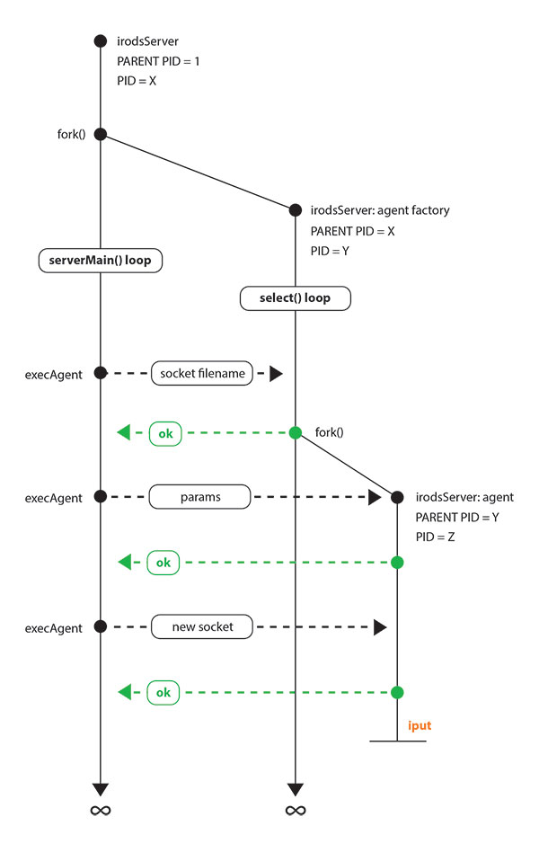

#

iRODS launches a long-running server process (`/usr/sbin/irodsServer`), which immediately forks the Agent Factory and optionally, the Delay Server (`/usr/sbin/irodsDelayServer`). All incoming API requests are serviced by the Agent Factory, and for every new connection the Agent Factory forks a new Agent. Each Agent will service its request as quickly as possible, and then terminate.

The iRODS Delay Server sleeps most of the time, but spawns an Agent every 30 seconds to check the delay queue for any delayed rules that need to be run. The frequency of the check can be modified. See the `delay_server_sleep_time_in_seconds` option in [Configuration](../system_overview/configuration.md#etcirodsserver_configjson) for more information.

Below is an example showing the process tree for an iRODS server.

    irodsServer
      ├─irodsAgent
      │   ├─irodsAgent
      │   ├─irodsAgent
      │   └─irodsAgent
      └─irodsDelayServer

| iRODS Process         | Expected Duration        | Expected Resident Memory Usage  |
| --------------------- | ------------------------ | ------------------------------- |
| irodsServer           | Long-running             | 34M                             |
| irodsDelayServer      | Long-running             | 33M                             |
| irodsAgent (factory)  | Long-running             | 92M                             |
| irodsAgent            | Depends on client        | 92M (minimum)                   |

TODO: Update or remove graphic.

