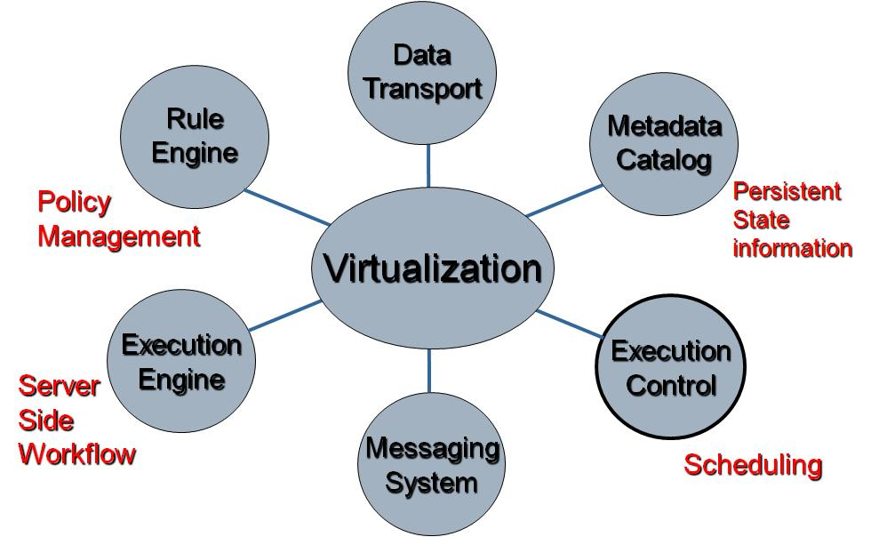

# iRODS 1.0

## Introduction

iRODS is a second generation data grid system providing a unified view and seamless access to distributed digital objects across a wide area network. The Storage Resource Broker (SRB) is an exemplar of the first generation data grid system and provided a unified view based on logical naming concepts - users, resources, data objects and virtual directories were abstracted by logical names and mapped onto physical entities - providing a physical-to-logical independence for client-level applications. iRODS builds upon this logical abstraction and takes it one level higher by abstracting the data management process itself called policy abstraction.

iRODS V1.0 is a production-quality release of the software whose alpha/beta versions were released earlier in 2006 and 2007. It provides user-friendly installation tools, a modular environment for extensibility through micro-services, a robust web-based interface, Java-enabling through the familiar JARGON interface, and a host of C and shell-based libraries and utilities for immediate application development. iRODS V1.0 comes with a well-rounded data grid functionality and can be used straight off the shelf to implement an enterprise-level data grid.

iRODS stands for integrated Rule-Oriented Data Systems.

The 'integrated' part of iRODS comes from the fact that it provides a unified software envelope for interactions with a host of underlying services which interact in complex fashion among themselves. This idea of an integrated envelope is different than a toolkit methodology wherein one is provided with a suite of modules (tools) which can be integrated by the user/application to form their own customized system. The integrated envelope exposes a uniform interface to the client application hiding the complexity of dealing with low-lying details of the 'tools' inside the envelope. We modeled the SRB software on the integrated envelope methodology with a single-server installation paradigm hiding the details about third-party authentication, authorization, auditing, metadata management, streaming access mechanism, resource (vendor-level) and other idiosyncrasies. With around 100 API functions and 80 command-level utilities a robust set of interfaces were available off-the-shelf for the user to start using a production-quality data grid system.

iRODS builds upon the integrated envelope paradigm but with more functionality and services. As shown in the Figure below, iRODS integrates the following functionalities:
 - Data Transport
 - Metadata Catalog for both system and user-defined metadata
 - Rule Engine for executing complex policies encoded as micro-services
 - Execution Engine for execution of remote micro-services as workflows
 - Scheduling System for immediate, delayed and periodic queuing and execution
 - Messaging System for out-of-band communication among micro-services
 - Virtualization system enabling the logical naming paradigm

## Virtualization

Data Virtualization is the underlying idea in the iRODS data grid system. Instead of a physical naming, iRODS adopts a virtual (or logical name) for every entity that interface with user or application. The mapping from the logical name to physical name is maintained persistently in the Metadata Catalog and the mapping is done at run time by the Virtualization sub-system. The virtualization pervades all aspects of iRODS and is seamlessly integrated into the various modules.

## Data Transport

iRODS provides different types of data transfer mechanism. iRODS can get and put files from a remote storage system (which is fronted by an iRODS server) or can transfer from one storage to another (as a third-party transfer). The access of the files can be either as a single file transfer or as a whole collection/sub-collection transfer. It can transfer these files in bulk mode (when several small files are being transferred) or in parallel mode when a large file is being transferred. All these different options are optimally selected depending upon the file sizes and the number of files being transferred. In iRODS V1.0 the storage system supported is any Unix file system including NSF or other mounted file system.

## Metadata Catalog

The iCAT catalog provides a means for persistently storing the state of the iRODS system. This includes the virtualization mapping as well as other system-metadata and user-defined metadata. iRODS V1.0 supports iCAT as Postgres or Oracle databases.

## Rule Engine

The Rule Engine executes rules as part of enforcing policies of the data being managed by iRODS. Several iRODS APIs automatically call the rule engine so that any required policies can be automatically checked and enforced. For example, on ingestion of a file, the rule for acPostProcForPut is called and can be used for performing collection/type specific tasks after ingestion. More information on Rules and their usage can be found at Rules.

## Execution Engine

The execution of micro-services is performed by the execution engine. Every iRODS node (server) is capable of executing micro-services. The rule syntax provides means for remotely executing micro-services. Hence one can have a chain of micro-services performed at different sites and the values of the copy-referenced variables are passed back to the calling node. Information about micro-services and how to pass parameters can be found at Micro-Services.

## Scheduler

The delayed execution and periodic execution are controlled by a built-in scheduler in the iRODS system. The iCAT stores persistent information about the schedule of activities and launches them through the execution engine as and when they need to be performed.

## Messaging System

In a future release, we plan to incorporate a messaging system as part of iRODS. This would be helpful for inter-micro-service communication (an out of band communication beyond the parameter passing and black-board infrastructure provided currently). This will also help when parallel processing is supported allowing them to communicate among them. The messaging system will provide a true distributed workflow environment for data processing.
